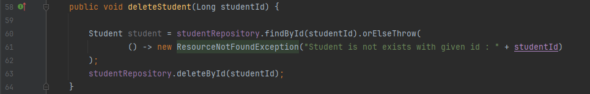

### Project CRUD Data Student using PostgreSQL
### Table of Contents

- 
    - [ Postman Test Video :](#-postman-test-video-)
- 
    - [ Rest API Create Student :](#-rest-api-create-student-)
- 
    - [ Rest API Get Student :](#-rest-api-get-student-)
- 
    - [ Rest API Get All Students :](#-rest-api-get-all-students-)
- 
    - [ Rest API Update Student :](#-rest-api-update-student-)
- 
    - [ Rest API Delete Student :](#-rest-api-delete-student-)

#
###  Postman Test Video :
https://youtu.be/liHrMLYPhBU?si=oACXzLYbWQOmmjp1

#
###  Rest API Create Student :
* `Service` 
  
  
  
* `ServiceImpl` 
  
    

* `Controller`
  
    

#
###  Rest API Get Student :
* `Service` 
  
    
  
* `ServiceImpl` 
  
    

* `Controller`
  
    

#
###  Rest API Get All Students :
* `Service` 
  
  
  
* `ServiceImpl` 
  
    

* `Controller`
  
    

#
###  Rest API Update Student :
* `Service` 
  
    
  
* `ServiceImpl` 
  
    

* `Controller`
  
    

#
###  Rest API Delete Student :
* `Service` 
  
    
  
* `ServiceImpl` 
  
    

* `Controller`
  
    